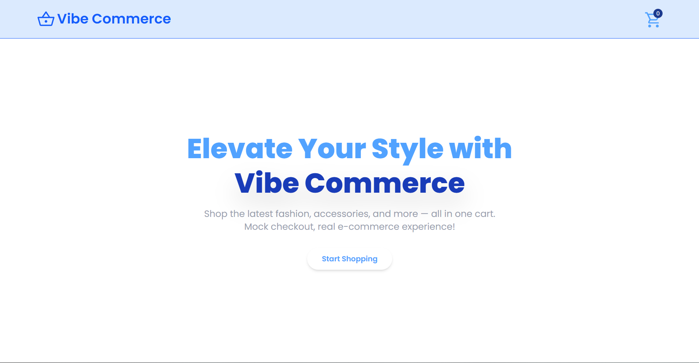
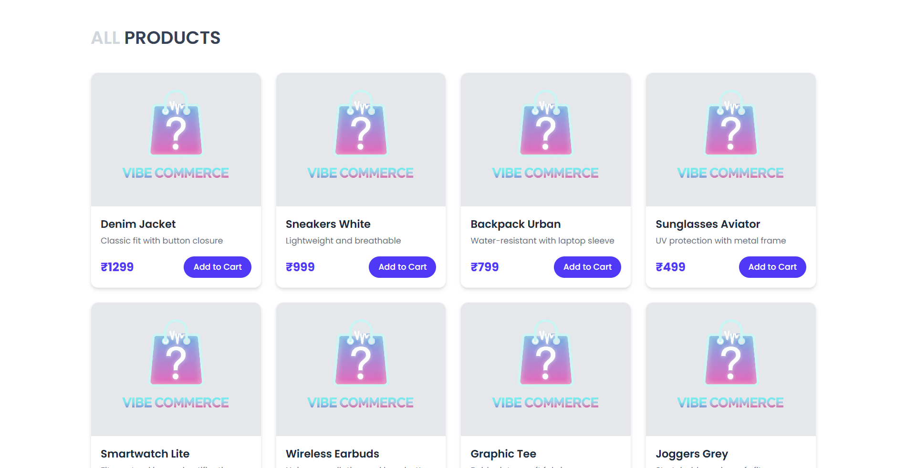
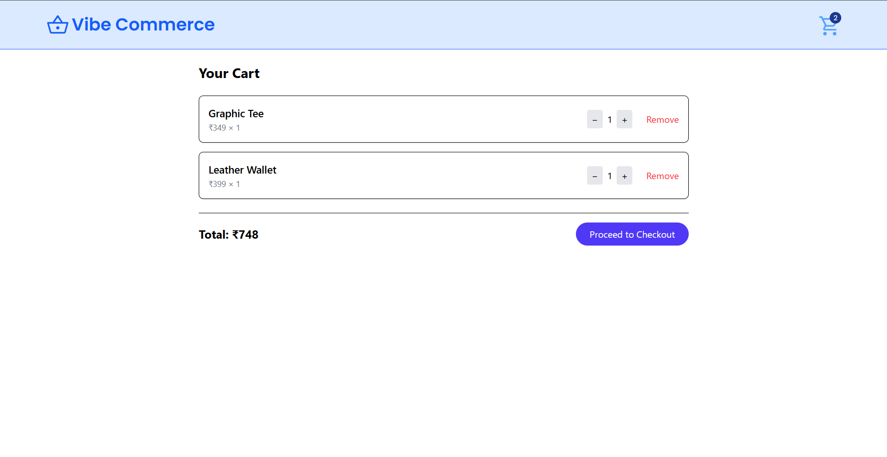
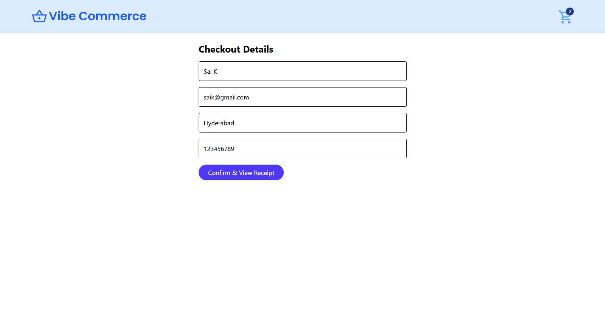
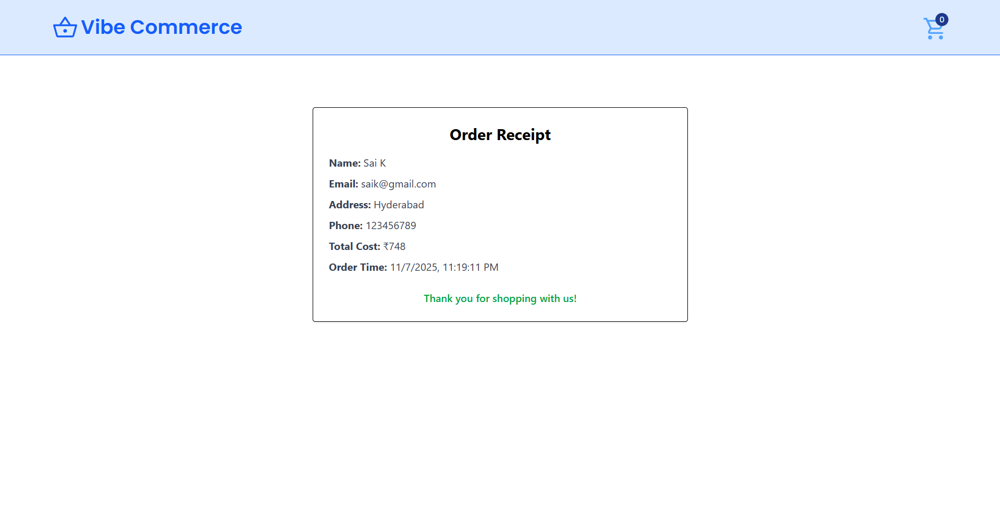

# 🛒 Vibe Commerce – MERN Stack Ecommerce App

A MERN-stack ecommerce application built for the **Vibe Commerce screening**. This project demonstrates product listing, cart management, and mock checkout flows using RESTful APIs and database integration.

---

## 🚀 Tech Stack

| Layer      | Technology           |
|------------|----------------------|
| Frontend   | React, Tailwind CSS  |
| Backend    | Node.js, Express     |
| Database   | MongoDB (or SQLite)  |
| APIs       | RESTful endpoints    |
| Versioning | Git & GitHub         |

---

## 📦 Features

### 🔧 Backend (Express + MongoDB)
- `GET /api/products` – Fetch 5–10 mock products (id, name, price)
- `POST /api/cart` – Add item to cart `{ productId, qty }`
- `DELETE /api/cart/:id` – Remove item from cart
- `GET /api/cart` – Get all cart items with product details and total
- `POST /api/checkout` – Submit cart items → return mock receipt `{ total, timestamp }`

### 🎨 Frontend (React)
- Product grid with **Add to Cart** buttons
- Cart page with:
  - Quantity update
  - Remove item
  - Total cost calculation
- Checkout form:
  - Collects name, email, address, phone
  - Displays receipt with order details
- Responsive design for desktop and mobile
- Toast notifications using **React Toastify**

---

## 📁 Project Structure
```
├── backend/
│ ├── models/
│ ├── routes/ 
│ └── server.js 
├── frontend/ 
│ ├── src/ 
│ │ ├── components/ 
│ │ ├── pages/ 
│ │ ├── context/ 
│ │ └── App.jsx 
├── .gitignore 
├── README.md
```


---

## 📦 Installation

### Backend
```bash
cd backend
npm install
npm start
```

---

### Frontend
```bash
cd frontend
npm install
npm run dev
```

---

## 📸 Screenshots

###  Landing Page


### 🛍️ Product Grid


### 🛒 Cart Page


###  Checkout Page


### 🧾 Receipt Modal


---


## 🧪 Testing

- UI tested across Chrome and Firefox  
- API tested using Postman  
- Cart and checkout flows validated with mock data  

---

## ✅ Notes

- No real payment integration — checkout is mocked  
- Cart data stored in MongoDB (or SQLite fallback)  
- Deployment is GitHub-only (no live hosting)  

---

## 📬 Contact

For questions or feedback, reach out via GitHub Issues or email.
